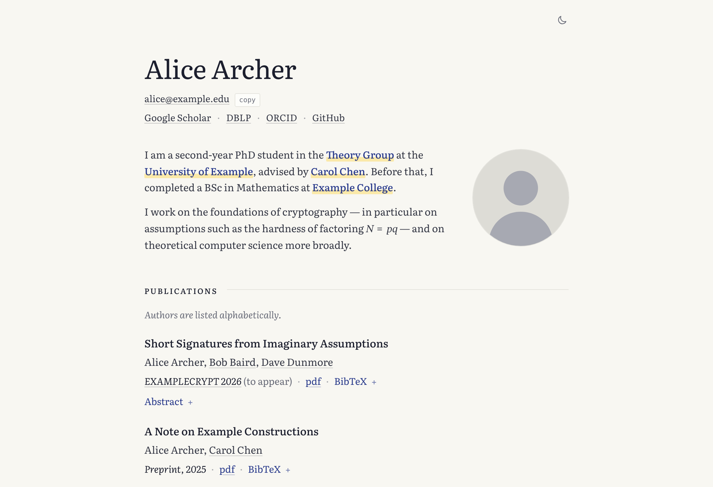

<h1 align="center">Corollary</h1>

<p align="center">
  <em>A homepage for theorists. It follows immediately from your publication list.</em>
</p>

<p align="center">
  <picture>
    <source media="(prefers-color-scheme: dark)" srcset="docs/img/screenshot-dark.png">
    
  </picture>
</p>

---

> **Corollary.** Let *T* be a TOML file listing your papers, talks, teaching
> and service. Then there exists a single-page academic homepage, rendered
> entirely at build time, with BibTeX, typeset mathematics and structured data,
> and it is rebuilt for you on every push.
>
> *Proof.* Click **Use this template**, edit `content/site.toml`, push. ∎

Corollary is for people whose homepage is, essentially, a publication list
with a face: theoretical computer science, cryptography, mathematics, and
their neighbours. It is one quiet column set like a printed page — your name
as the title, an introduction wrapping around your portrait, your work under
small-caps heads — not a sidebar and a column of cards.

## What it gets right

- **Your field's conventions, built in.** Alphabetical author order is checked,
  not assumed: set the Hardy–Littlewood note once and it is printed only while
  every paper really is alphabetical, so it can never become false.
  Citation keys follow the `ABCD26` style (or `archer2026`, if you prefer).
- **One line per milestone.** A paper goes up on ePrint: add
  `eprint = "2026/0123"`. The link appears and the BibTeX entry rewrites itself
  from `@inproceedings` to the ePrint `@misc`. Likewise `arxiv` and `doi`.
- **LaTeX, without a maths engine.** Write `\( \mathbb{Z}_{N^2} \)` in any
  title or abstract; it is converted to MathML at build time. No MathJax, no
  KaTeX, no CDN, no flash of raw TeX. `$5 and $10` stays prose.
- **Publications and manuscripts kept apart.** `status` decides; a manuscript
  under submission is never mistaken for a paper of record, gets no unusable
  BibTeX stub, and is not advertised to search engines.
- **Coauthors linked once.** Write a homepage URL once; every paper naming that
  person links to it. Your own name is never a link.
- **Typed like a book.** Literata with true small caps and old-style figures,
  and text that follows the curve of your portrait.
- **Paper and blackboard.** Blue-black ink on ivory, links marked with a
  stroke of yellow highlighter that sweeps across the word on hover; by night,
  white chalk on slate with links written in yellow chalk.
- **Fast and private by construction.** About 108 KB in total, 80 of it the
  typeface. Zero third-party requests, no cookies, no tracking, and complete
  without JavaScript — a 24 KB WebAssembly module adds only the theme toggle
  and copy buttons.
- **Ships the boring parts.** JSON-LD for search engines, Open Graph, sitemap,
  robots.txt, a generated favicon, a 404 page, print styles, and WCAG AA
  contrast in both themes.

### Who it is not for

If you want a blog, a news feed, a lab website, project galleries, or a CV
rendered as a web page, you want something else — [al-folio] and
[Hugo Blox] are excellent at those. Corollary is for the page a reader opens
from your paper to find out who you are and what else you have written.

[al-folio]: https://github.com/alshedivat/al-folio
[Hugo Blox]: https://github.com/HugoBlox/kit

## Quick start

You need nothing installed to publish; GitHub builds the site.

1. Click **Use this template → Create a new repository**. Name it
   `<username>.github.io` for a site at `https://<username>.github.io`, or
   anything else for `https://<username>.github.io/<name>/`.
2. In the new repository: **Settings → Pages → Build and deployment →
   Source: GitHub Actions**.
3. Edit [`content/site.toml`](content/site.toml) — directly on GitHub is fine.
   Replace Alice Archer with yourself, and add your portrait to
   [`static/assets/img/`](static/assets/img/).
4. Commit. The **Deploy site** action builds and publishes in about two
   minutes. (If the very first run failed because step 2 came after it,
   re-run it from the Actions tab.)

**Custom domain:** set it under **Settings → Pages**, and set
`base_url = "https://your.domain"` under `[site]`.

## Working locally

```sh
rustup target add wasm32-unknown-unknown   # once
cargo install wasm-pack --locked           # once; optional

./scripts/serve.sh                         # build, then serve at http://localhost:8000
```

Rerun `serve.sh` after editing; a rebuild takes a second or two. Without
`wasm-pack` the page is still complete, just without the theme toggle and copy
buttons. `cargo test -p sitegen` runs the generator's tests.

## Configuring

Everything is in `content/site.toml`, which doubles as a commented example.
The full reference is [docs/CONFIGURATION.md](docs/CONFIGURATION.md). In brief:

| Table | What it holds |
| --- | --- |
| `[site]` | title, description, `base_url`, footer, language |
| `[person]` | name, role, institution, email, portrait, profile links |
| `[about]` | the introduction (Markdown + LaTeX) |
| `[[publications]]` | papers; `status` sorts them into Publications or Manuscripts |
| `[[talks]]`, `[[teaching]]`, `[[service]]` | the other lists |
| `[people]` | coauthor homepages, written once |
| `[[sections]]` | which sections appear, in what order, with what headings |
| `[theme]` | colour overrides, light and dark |
| `[conventions]`, `[bibtex]`, `[labels]`, `[features]` | the finer switches |

A misspelt key is a build error, not a silently missing line.

## Making it yours

From least to most invasive — see [docs/CUSTOMIZING.md](docs/CUSTOMIZING.md):

1. **Colours** — `[theme]` in `site.toml`. Any CSS custom property, light and
   dark separately.
2. **Small CSS changes** — `static/assets/css/custom.css`, loaded last.
3. **Order and headings** — `[[sections]]`. Built-in kinds: `about`,
   `publications`, `manuscripts`, `talks`, `teaching`, `service`, plus the
   generic `list` (awards, students, grants, …) and free-form `markdown`.
4. **A new kind of section** — create `templates/sections/<kind>.html` and
   use `kind = "<kind>"`. Any keys you add to that `[[sections]]` entry are
   available to the template. No Rust required.
5. **Markup** — `templates/`, written in [Tera]. `partials/head-extra.html`
   and `partials/body-end.html` are empty hooks for analytics and the like.
6. **The generator** — `sitegen/src/`, a small Rust program split by concern.

Keeping your changes in `content/`, `static/` and `custom.css` makes pulling in
later versions of Corollary a clean merge:

```sh
git remote add corollary https://github.com/DeviousCilantro/corollary.git
git fetch corollary && git merge corollary/main --allow-unrelated-histories
```

[Tera]: https://keats.github.io/tera/docs/

## Layout

```text
content/site.toml      all content
templates/             base, index, 404; partials/; sections/<kind>.html
static/                copied verbatim: css, fonts, images, files
sitegen/src/           the generator: config, publications, bibtex, markdown, seo, render
wasm/                  theme toggle and copy buttons, in Rust
scripts/               build.sh, serve.sh
docs/                  configuration, customising, design notes
public/                generated; not committed
```

## Attribution

Corollary is MIT-licensed: use it, change it, ship it. The licence asks one
thing — keep the [`LICENSE`](LICENSE) file in your copy. Your own content is
yours, under whatever terms you choose.

The small *Built with Corollary* line in the footer is optional
(`credit = false` under `[site]` removes it), but it is how other theorists
find the template, so leaving it is a kind thing to do. A star helps too.

Corollary was written by [DeviousCilantro](https://github.com/DeviousCilantro)
and grew out of the author's own homepage. It stands on [Literata] (TypeTogether, SIL
Open Font License), [pulldown-cmark], [pulldown-latex], [Tera] and
[wasm-bindgen].

[Literata]: https://github.com/googlefonts/literata
[pulldown-cmark]: https://github.com/pulldown-cmark/pulldown-cmark
[pulldown-latex]: https://github.com/carloskiki/pulldown-latex
[wasm-bindgen]: https://github.com/wasm-bindgen/wasm-bindgen
